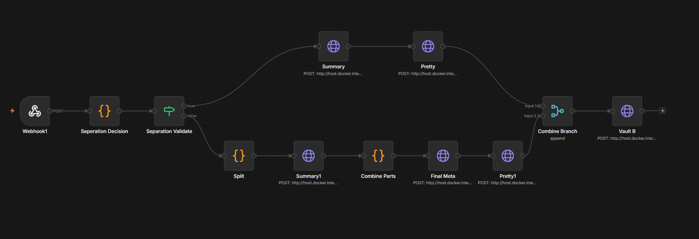

# Article Summarizer - Local AI Pipeline

A fully local, privacy-first article summarization pipeline powered by **n8n**, **LM Studio**, and a **Go** backend. Summarize any text — from blog posts to research papers — using a local LLM, with automatic note-taking to Obsidian.

No cloud APIs. No data leaves your machine.




## Features

- **Smart Chunking** — Automatically splits long texts into context-safe chunks (≤5000 chars) for models with limited context windows (e.g., 4096 tokens)
- **Map-Reduce Summarization** — Short texts get a direct summary; long texts are chunked, summarized individually, then synthesized into a cohesive final summary
- **Markdown Formatting** — A dedicated formatting step turns raw summaries into clean, professional Markdown
- **Critical Review (Grill)** — An LLM-powered "peer reviewer" that ruthlessly critiques each summary, identifying missing points, weak claims, bias, and overlooked connections
- **Processing Stats** — Tracks total processing time, character counts, and estimated token usage for every run
- **Obsidian Integration** — Summaries are auto-saved to your Obsidian vault via the Local REST API plugin, with full frontmatter metadata (date, model, processing time, token count)
- **Chrome/Brave Extension** — Select text on any page, right-click → summarize. Or paste text in the popup
- **100% Local** — Everything runs on your machine. No API keys, no cloud, no data leakage

## Components

| Component             | Tech                           | Purpose                                     |
| --------------------- | ------------------------------ | ------------------------------------------- |
| **Web App**           | Go + embedded HTML/CSS/JS      | Desktop UI for pasting and summarizing text |
| **Workflow Engine**   | n8n (Docker)                   | Orchestrates the summarization pipeline     |
| **LLM**               | LM Studio (Mistral 7B)         | Local AI inference                          |
| **Note Storage**      | Obsidian + Local REST API      | Saves formatted summaries as Markdown       |
| **Browser Extension** | Chrome Extension (Manifest v3) | Quick access from any webpage               |

## Prerequisites

- [Docker](https://docs.docker.com/get-docker/) — for running n8n
- [Go 1.21+](https://go.dev/dl/) — for building the web app
- [LM Studio](https://lmstudio.ai/) — for local LLM inference
- [Obsidian](https://obsidian.md/) + [Local REST API plugin](https://github.com/coddingtonbear/obsidian-local-rest-api) (optional)

## Quick Start

### 1. Start n8n

```bash
docker compose up -d
```

Open `http://localhost:5678` and set up your n8n account.

### 2. Import the Workflow

- In n8n, go to **Workflows → Import from File**
- Select `workflow.json` from this repo
- Update the Obsidian API key in the **"Save to Obsidian"** node (or remove that node if you don't use Obsidian)
- Click **Publish** to activate the workflow

### 3. Configure LM Studio

- Download and install [LM Studio](https://lmstudio.ai/)
- Download the `mistral-7b-instruct-v0.2` model (or any model you prefer)
- Start the local server on port `1234`

### 4. Build & Run the Web App

```bash
cd app
go build -o article-summarizer .
./article-summarizer
```

Open `http://localhost:8090` in your browser.

### 5. Install the Browser Extension (Optional)

- Open `brave://extensions` (or `chrome://extensions`)
- Enable **Developer mode**
- Click **Load unpacked** → select the `extension/` folder


## How It Works

### Pipeline Overview

```
Webhook → Start Timer → Chunking Decision → ...
```

### Short Text (≤ 5000 chars)

```
Text → Summarize → Format → Merge → Critical Review → Stats → Obsidian
```

### Long Text (> 5000 chars)

```
Text → Split into Chunks → Summarize each chunk
     → Merge summaries → Synthesize final summary
     → Format → Merge → Critical Review → Stats → Obsidian
```

### Workflow Nodes

| Node                       | Type         | Description                                                  |
| -------------------------- | ------------ | ------------------------------------------------------------ |
| **Webhook**                | Webhook      | Receives POST requests with article text                     |
| **Start Timer**            | Code         | Records start time + estimates input tokens                  |
| **Chunking Decision**      | Code         | Decides if text needs splitting (threshold: 5000 chars)      |
| **Needs Chunking?**        | IF           | Routes to short or long pipeline                             |
| **Summarize (Short)**      | HTTP Request | Single-pass summarization for short texts                    |
| **Split into Chunks**      | Code         | Splits long text into line-aware chunks                      |
| **Summarize Chunk**        | HTTP Request | Summarizes each chunk individually                           |
| **Merge Chunk Summaries**  | Code         | Combines chunk summaries into one text                       |
| **Synthesize Final Summary** | HTTP Request | Creates cohesive summary from merged chunks                |
| **Format (Short/Long)**    | HTTP Request | Formats summary into clean, professional Markdown            |
| **Merge Branches**         | Merge        | Joins short and long pipelines                               |
| **Critical Review**        | HTTP Request | LLM-powered critique of the summary (missing points, weak claims, bias) |
| **Timing & Stats**         | Code         | Calculates processing time and token estimates               |
| **Save to Obsidian**       | HTTP Request | Saves summary + critique + stats to Obsidian vault           |

The chunking threshold (5000 chars) is tuned for Mistral 7B's 4096-token context window. Adjust `SAFE_CHARS` and `CHARS_PER_CHUNK` in the Chunking Decision node if you use a model with a larger context.

## Output Format

Each saved note includes:

**Frontmatter:**
```yaml
---
date: 2026-03-30
time: 14:30:00
model: mistral-7b-instruct-v0.2
method: map-reduce
processing_time: 45.2s
estimated_tokens: 3500
---
```

**Body:**
1. Formatted summary (Title, Main Idea, Key Concepts, Key Findings, Conclusion)
2. 🔥 Critical Review (Missing Points, Weak Claims, Bias & Blind Spots, Depth Issues, Overlooked Connections, Overall Verdict)
3. ⏱️ Processing stats line

## Project Structure

```
.
├── app/                    # Go web application
│   ├── main.go             # Server, API handler, text sanitizer
│   └── static/             # Embedded frontend
│       ├── index.html
│       ├── style.css
│       └── script.js
├── extension/              # Chrome/Brave extension
│   ├── manifest.json
│   ├── popup.html
│   ├── popup.js
│   └── background.js
├── workflow.json            # n8n workflow (import this)
├── docker-compose.yml       # n8n Docker setup
└── README.md
```

## Customization

### Using a Different Model

In the n8n workflow, find the HTTP Request nodes and change the `model` field:

```json
"model": "your-model-name"
```

Also adjust `SAFE_CHARS` in the "Chunking Decision" Code node based on your model's context window.

### Changing the Summary Structure

Edit the prompt in the "Summarize (Short)" HTTP Request node. The current structure:

```
## Title
## Main Idea
## Key Concepts
## Key Findings or Arguments
## Conclusion
```

### Tuning the Critical Review

The "Critical Review" node uses `temperature: 0.7` for more diverse critique. Lower it for more conservative feedback, or adjust the prompt to change the review criteria.

### Disabling Obsidian

Simply remove or disable the "Save to Obsidian" node in the n8n workflow. Summaries will still be returned to the web app and extension.

## License

MIT — see [LICENSE](LICENSE)
